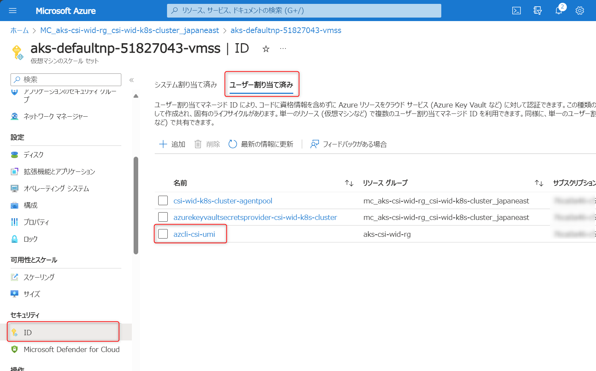

# aks-csi-driver-keyvault-inspection

## 概要
Secret Store CSI Driver for Azure Key Vault を検証するためのリポジトリです。

参考記事：https://learn.microsoft.com/ja-jp/azure/aks/csi-secrets-store-driver

## 何が確認できるか
Secret Store CSI Driver for Azure Key Vault により、Key Vault に格納されているシークレットの値をファイルとして Pod にマウントします。

Key Vault に格納されたシークレットは、Pod から参照することが可能になります。

## 手順

### ローカル環境上での操作 (前編)
1. `./azure` 配下に `terraform.tfvars` ファイルを作成する

作成例：
```
location             = "japaneast"
namespace            = "azcli-csi"
service_account_name = "azcli-csi-sa"
```

2. Azure Resource をデプロイする
※ chdir で指定するパスはご利用の OS が解釈できるパスに設定してください
```
terraform -chdir=./azure init
terraform -chdir=./azure apply
```

デプロイ完了後、下記のパラメータが出力されるのでそのままコピーしておきます。

```
aks_cluster_name              = "csi-wid-k8s-cluster"
client_id_for_helm            = "00000000-0000-0000-0000-000000000000"
key_vault_name_for_helm       = "csi-0000000000001000"
namespace_for_helm            = "azcli-csi"
resource_group                = "aks-csi-wid-rg"
service_account_name_for_helm = "azcli-csi-sa"
tenant_id_for_helm            = "00000000-0000-0000-0000-000000002000"
```

### Azure Portal 上での操作
3. Azure Portal へ移動し、AKS 用の Azure リソースが格納されているリソース グループ [ MC_aks-csi-wid-rg_csi-wid-k8s-cluster_japaneast ] > 仮想マシンのスケール セット (VMSS) [ aks-defaultnp-XXXXXXXX-vmss ] のリソースを選択します。

 

4. VMSS の詳細画面から左ブレードの [ ID ] > [ ユーザー割り当て済み ] へ移動し、2. の手順で作成されたユーザー割り当てマネージド ID [ azcli-csi-umi ] を追加します。




ここまでで Azure Portal からの操作は完了です。

### ローカル環境上での操作 (後編)
5. `./helm` 配下に `terraform.tfvars` ファイルを作成する

※ 2. で出力された内容をそのまま張り付けていただき、[aks_cluster_name] / [resource_group] の行を削除するのが手っ取り早いです。

```
client_id_for_helm            = "00000000-0000-0000-0000-000000000000"
key_vault_name_for_helm       = "csi-0000000000001000"
namespace_for_helm            = "azcli-csi"
service_account_name_for_helm = "azcli-csi-sa"
tenant_id_for_helm            = "00000000-0000-0000-0000-000000002000"
```

6. 2. で作成された AKS クラスターを操作するための context を下記コマンドにて生成する

```
az aks get-credentials -g aks-csi-wid-rg -n csi-wid-k8s-cluster
```

7. 下記コマンドを実行し、AKS 上に必要なリソースをデプロイします。
※ chdir で指定するパスはご利用の OS が解釈できるパスに設定してください
```
terraform -chdir=./helm init
terraform -chdir=./helm apply
```

8. 下記コマンドを実行し、新しい Pod ができていることを確認します。

```
kubectl get po -n azcli-csi
```

8. 下記コマンドにて `example secret!!!!` が出力されれば、CSI Driver による Key Vault のシークレット取得ができていることを確認できます。

```
kubectl exec -it { 7. で確認した Pod } -- cat /mnt/secrets-store/example-secret
```

CSI Driver より Key Vault のリソースを取得するための検証手順は以上となります。
